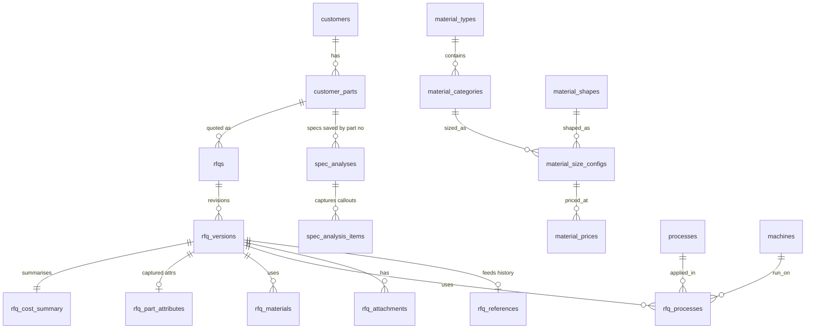

# RFQ & Cost Estimation System

A web application for **forging‑part manufacturers** that turns an incoming RFQ (with a
customer design drawing) into a **defensible, itemised estimated quotation**.

The system reads the drawing, captures part and material attributes, and a **deterministic
cost engine** computes the quote from configured master rates. AI assists with drawing
extraction and historical lookup — **it never sets the price**. Every RFQ carries multiple
**versions per revision**, keyed to the **Customer Part Number**, and completed estimates
become **historical reference data** for future RFQs.

**Status:** MVP feature‑complete (phases 0–7). 22 unit tests + 20 end‑to‑end smoke checks
passing.

---

## Table of contents

- [Guiding principles](#guiding-principles)
- [The cost model](#the-cost-model)
- [Functionality](#functionality)
  - [Master data](#1-master-data)
  - [Customer parts & RFQ versioning](#2-customer-parts--rfq-versioning)
  - [Spec Analysis — drawing → data](#3-spec-analysis--drawing--data)
  - [Deterministic cost engine](#4-deterministic-cost-engine)
  - [History & reference lookup](#5-history--reference-lookup)
  - [Quotation & exports](#6-quotation--exports)
  - [Dashboard](#7-dashboard)
  - [Audit log & security](#8-audit-log--security)
- [Roles & permissions](#roles--permissions)
- [Technical architecture](#technical-architecture)
- [Data model](#data-model)
- [API reference](#api-reference)
- [Frontend](#frontend)
- [Local setup](#local-setup)
- [Configuration](#configuration)
- [Scripts](#scripts)
- [Testing](#testing)
- [Deployment](#deployment)
- [Project layout](#project-layout)
- [Known limitations](#known-limitations--follow-ups)

---

## Guiding principles

1. **AI assists, rules decide.** PDF extraction and historical lookup use an LLM; all costing
   is a pure, deterministic, server‑side engine that is independent of the LLM and unit‑tested.
2. **Specs become saved data, keyed to the part number.** Every customer drawing is parsed
   into a structured **Spec Analysis** record and persisted against the **Customer Part
   Number** + RFQ revision — so a part's captured specs, revisions and past quotes are always
   retrievable and reusable.
3. **Everything is master‑driven and effective‑dated.** Prices and rates change over time;
   every estimate records the rate that was valid on its costing date.
4. **Versioned by revision.** A Customer Part Number can be re‑quoted many times; each
   revision is a new **RFQ Version** with its own cost sheet, and all history is preserved.
5. **Auditable.** Each quote line ties back to a rate × quantity/time and a formula; both the
   AI‑recommended and estimator‑set values are stored, and every mutation is logged.

---

## The cost model

The engine is a pure function: `computeCost(EngineInput) → CostSummary`. Each component is
independently testable.

```
Material base cost
  + Handling            (procurement % + transportation + storage %)
  + Machining cost       (machine processes)
  + Manual process cost  (₹/pc processes)
  + Subcontracting cost  (heat treatment, plating, …)
  + QC cost              (auto-derived — the user never types it)
  = Manufacturing cost
  + Administration cost  (% of manufacturing cost)
  = Subtotal
  + Profit margin        (% driven by Customer Rating; estimator may adjust or override)
  = Quoted price / piece   ×  quantity = Total quote
```

### Material base cost / purchase cost (§4.1)

```
# MANUFACTURED
input_weight_kg = net_weight_kg × (1 + forging_loss_pct/100)     ← the forging allowance
material_cost   = input_weight_kg × (1 + wastage_pct/100) × rate_per_kg(as-of date)

# BOUGHT_OUT (procured / assembly part)
material_cost   = purchase_price_per_pc
```

`rate_per_kg` is resolved from **Material Category (grade) × Shape × Size config**,
effective‑dated (`material_prices`). If the estimator enters an explicit **material line**
(e.g. a bar‑stock cut weight), that `input_weight_kg` overrides the `net × (1 + loss)` rule.

A **bought‑out part** (`sourcing_type = BOUGHT_OUT`) skips the material weight/rate and the
machining build‑up — its purchase price is the base. Handling, QC, admin and margin still
apply; process lines are still summed, so you can add assembly / incoming‑inspection lines.

### Handling cost (§4.2)

```
procurement    = base_cost × procurement_pct/100
storage        = base_cost × storage_pct/100
transportation = transportation_value × input_weight_kg   (PER_KG)
               = transportation_value / batch_qty         (PER_LOT, amortised)
               = transportation_value                     (FIXED, ₹/pc)
               = base_cost × transportation_value/100      (PCT)
packing        = packing_value                            (FIXED, ₹/pc)
               = base_cost × packing_value/100             (PCT)
```

`base_cost` is the material / purchase cost. **Transportation and packing both default to 0**
and are each either a fixed ₹/pc or a percentage. From a **Handling Config** master — global,
or per material type (specific wins over global).

### Machine / manual / subcontract process cost (§4.3–4.5)

Every process line carries a **costing method**, and the same per‑piece formula is applied
then bucketed by process type (`MACHINE` → machining, `MANUAL` → manual, `SUBCONTRACT` →
subcontract):

| Method | Formula | Best for |
|---|---|---|
| **`CYCLE_TIME`** *(default)* | `(cycle_time_sec / 3600) × machine_hour_rate` | CNC turning/milling, VMC, drilling |
| **`PER_KG`** | `input_weight_kg × rate_per_kg` | Forging press / hammer operations |
| **`PER_STROKE`** | `strokes × rate_per_stroke` | Press forging |
| **`PER_OP`** | `count × standard_op_rate` | Well‑known repeatable ops |
| **`FLAT_PC`** | `count × rate_per_pc` | Simple, stable operations |
| **`PER_LOT`** | `rate_per_lot / batch_qty` | Lot‑priced subcontracting |

**Machine‑hour rate build‑up** (stored per machine so it is transparent):

```
machine_hour_rate = depreciation/hr + power/hr + maintenance/hr
                    + operator/hr + tooling/hr + factory_overhead/hr
```

If a `CYCLE_TIME` line's rate is left blank, the engine falls back to the machine's
hour‑rate; other methods fall back to the process's `default_rate`.

### QC cost — auto‑derived (§4.6)

QC is **never typed by the user**; a configurable QC rule derives it:

| Method | Formula |
|---|---|
| **`PCT_OF_MFG`** *(default)* | `(material + handling + machining + manual + subcontract) × qc_pct/100` |
| **`PER_INSPECTION`** | `Σ` of the named inspection costs (FAI, in‑process, final, CMM, certificate) |
| **`RULE`** | `pre_qc_cost × (qc_pct + uplift_pct)/100` |

### Administration + margin (§4.7)

```
mfg_cost      = material + handling + machining + manual + subcontract + qc
admin_cost    = mfg_cost × admin_pct/100
subtotal      = mfg_cost + admin_cost
recommended   = base_margin(customer.rating) + estimator_adjustment_pct
margin_pct    = estimator_override_pct ?? recommended          (0 is respected)
quoted_per_pc = subtotal × (1 + margin_pct/100)
total_quote   = quoted_per_pc × quantity
```

Both `recommended` (`ai_recommended_margin_pct`) and the final `margin_pct` are stored on
the cost summary and written to the audit log.

---

## Functionality

### 1. Master data

All master data is config‑driven (one generic CRUD component) with search, soft‑delete and
RBAC. The navigation pane has **one entry per functional area**; each opens a **tabbed
screen**, and parent rows drill into their child records:

| Nav entry | Sections (tabs) | Drill‑down |
|---|---|---|
| **Customer Master** | Customers · Rating → Margin | — |
| **Material Master** | Types · Grades · Shapes · Handling | **Grades** and **Shapes** rows → **Size configs** (scoped) → **Prices** (scoped) |
| **Process & Machine** | Processes · Machines | — |
| **Costing Configuration** | Product Types · QC · Overhead / Admin | — |

Size configs and prices are **not** top‑level tabs — they are reached only via a parent row's
"Size configs" / "Prices" action, which opens the child list filtered to that parent (the
parent field is pre‑filled and locked in the create form). A "Back" breadcrumb returns up the
chain. Server‑side this uses `?<fkField>=<id>` filtering (`filterableFields` on the CRUD
factory).

| Master | Notes |
|---|---|
| **Customers** | Rating 1–5 — drives the margin recommendation |
| **Customer rating → margin map** | Base margin % per rating 1–5 |
| **Material types → grades → shapes → size configs → prices** | The hierarchy; grade carries density, price is effective‑dated ₹/kg |
| **Handling config** | Procurement % · storage % · **transportation** (PER_KG / PER_LOT / FIXED ₹/pc / PCT) · **packing** (FIXED ₹/pc / PCT) — transport & packing default to 0; global or per material type |
| **Processes** | `process_type` (MACHINE/MANUAL/SUBCONTRACT) + `costing_method` + default rate |
| **Machines** | Hourly‑rate build‑up (the `hourly_rate` is a derived roll‑up) |
| **Product types** | Used in part analysis + history reference |
| **QC config** | Method + `qc_pct` + inspection standards (JSON) |
| **Overhead config** | Administration % |

**Effective‑date integrity:** `effectiveTo ≥ effectiveFrom` is enforced, and creating a new
rate row **auto‑closes the prior still‑open row** (stamps its `effectiveTo` with the new
`effectiveFrom`) so lookups are always unambiguous.

### 2. Customer parts & RFQ versioning

- **Customer Parts** — the anchor for RFQs and saved spec data (customer, part number, part
  name, product type, drawing no, current revision).
- **RFQ** — header (RFQ number, part, dates, annual/batch qty, currency, status). Creating an
  RFQ also creates **revision 1**. The **RFQ number is auto-generated** as `YYYY/MM/NNNN` —
  `NNNN` is a running counter that resets to `0001` when the year rolls over (the month segment
  is display-only). A number can still be supplied explicitly.
- **New RFQ from spec** — a wizard (`/rfqs/new`): upload the customer drawing → the part number
  (usually in the file name), customer, revision and specs are read from it → a **revision
  prompt** appears if that part already has an RFQ → enter annual/batch qty → the RFQ (or a new
  revision on the latest RFQ for that part) is created with a **draft cost sheet** already
  built, and the quotation can be generated in one click. An unknown customer is auto-created
  (rating 3) and a missing material grade is flagged for the estimator.
- **RFQ Versions** — `POST /rfqs/:id/versions` adds a new revision: auto `revision_no = max+1`,
  flips `is_current` on the siblings in one transaction, and can copy part attributes from an
  existing version. Every version has its own `rfq_part_attributes`, cost sheet and reference.
- **RFQ detail screen** — editable RFQ header, a **revision switcher**, per‑revision
  **part‑attributes** form (**sourcing: manufactured / bought‑out**, then either material
  grade/shape + forging loss % **or** purchase price + supplier, plus product type, net weight,
  surface finish, hardness, heat treatment, dimensions/tolerances/features, reviewed flag),
  and "Make current".
- **RFQ grid** — filter by status + free text, status pills, current‑revision quoted price,
  link to detail.

### 3. Spec Analysis — drawing → data

The core capability: **read the customer PDF, generate structured data, save it by part
number.**

1. **Upload** a PDF or image drawing (`POST /rfq-versions/:id/attachments`, Multer → disk).
2. **Analyze** (`POST /rfq-versions/:id/analyze-spec`) — the drawing is sent to Claude
   (`claude-opus-5`, document/vision block) with a strict extraction prompt. The model returns
   `{ header, items[], flags[] }`:
   - **header** — title‑block identity (drawing no, title, customer, CO no, rev, sheet, scale,
     material note, designed/detailed/checked, date) and overall attributes (product type,
     overall length, max OD, across‑flats, section view, general‑tolerance table, notes).
   - **items** — every callout as a generic row: `DIAMETER`, `LENGTH`, `THREAD`, `HOLE`,
     `CHAMFER`, `UNDERCUT`, `GROOVE`, `GDT`, `SURFACE_FINISH`, `TOLERANCE`, `ACROSS_FLATS`,
     `NOTE` — with nominal value, unit, tolerances, fit class (e.g. `m6`), datum, GD&T type,
     verbatim `raw_text` and a per‑item confidence.
   - **flags** — missing / ambiguous data the estimator must resolve (e.g. material shown as
     "AS PER BOM").
3. **Persist** — one `spec_analysis` row **upserted per `(customer_part_id, revision)`**, plus
   its `spec_analysis_items`. Re‑analyzing the same part revision updates it (and resets
   `reviewed`); a new revision adds a new row. The full raw extraction is kept in
   `raw_extract` (JSON).
4. **Derive weights** — `est_input_weight_kg` = bounding bar stock (max OD × overall length);
   `est_net_weight_kg` = mean captured diameter over the length. Both feed the cost engine.
5. **Review** — an editable grid grouped by item type, editable header fields, add/remove
   items, "Save & mark reviewed" (`PUT /rfq-versions/:id/spec`).
6. **Apply** — `POST /rfq-versions/:id/spec/apply` pushes `est_net_weight_kg` →
   `part_attributes.net_weight_kg`, matches the product type, and records the material note.

**No API key?** With a placeholder `ANTHROPIC_API_KEY` the analyzer returns a **deterministic
mock extraction** (clearly flagged) so the whole flow stays demoable and testable.
`GET /customer-parts/:id/specs` returns the full versioned spec history for a part.

### 4. Deterministic cost engine

- **Pure function** in `apps/api/src/cost-engine/` — no Prisma, no Express, no LLM, no clock
  beyond a caller‑supplied `asOfDate`. Fully covered by **22 vitest unit tests**.
- **Resolver** (`resolve.ts`) loads a version + effective‑dated masters (material price as‑of
  date, handling config with specific→global fallback, QC / overhead / margin lookup) into an
  `EngineInput`, collecting **warnings** for anything missing.
- **Cost sheet editor** on the RFQ detail page: a material line, a process‑line grid
  (process / machine / method / qty / rate, blank rate = auto), margin adjustment/override
  inputs, a **Compute** button, resolver warnings, and the full cost build‑up table.
- `POST /rfq-versions/:id/compute` runs the engine, upserts `rfq_cost_summary`, writes each
  line's computed `cost` back, and moves `DRAFT → COSTED`. `persist: false` computes without
  saving (live preview).

### 5. History & reference lookup

- When a version reaches **QUOTED / WON / LOST**, an `rfq_reference` row is (re)built:
  product type, material grade, key dims (pulled from the part's spec analysis), quoted ₹/pc,
  outcome, and an optional **actual cost**.
- `GET /reference/similar?partId=… | versionId=…` ranks past references by a weighted
  similarity score: `+3` same product type, `+3` same material, decaying proximity on
  net weight (×2.5), OD (×1.5), length (×1.5), across‑flats (×0.5), plus a small bonus for
  proven (WON) quotes. The part itself is excluded.
- "Reference & similar RFQs" panel on the RFQ detail page — match‑strength bars, quoted vs
  actual price, outcome pills, and controls to set the actual cost / mark won / mark lost.

### 6. Quotation & exports

- `POST /rfq-versions/:id/quote` — approve + generate: marks the revision (and RFQ) `QUOTED`,
  records the reference, and returns the quotation view model.
- Downloads (blob fetch with the auth header, so they work behind JWT):
  - `GET /rfq-versions/:id/cost-sheet.pdf` — full itemised cost sheet (pdfkit)
  - `GET /rfq-versions/:id/cost-sheet.xlsx` — the same as a formatted spreadsheet (exceljs)
  - `GET /rfq-versions/:id/quotation.pdf` — client‑facing quote (line item, unit price, total,
    terms, 30‑day validity)
- "Quotation & export" panel on the RFQ detail page with one‑click downloads.

### 7. Dashboard

`GET /reports/dashboard` → live KPIs (RFQs, customer parts, open quotes, win rate),
open‑pipeline value, won value, active customers, a 6‑month **RFQs / quoted / won** bar chart,
and a clickable **recent‑activity** feed.

### 8. Audit log & security

- **`audit_log`** — every master, customer‑part, RFQ, version, **compute** (final vs
  AI‑recommended margin), **quote**, and spec analyze/review mutation is recorded with the
  actor. Fire‑and‑forget: a logging failure never breaks the request it records.
- **Audit Log screen** (`GET /audit-log`, ADMIN/MANAGER only) — filter by entity type,
  per‑action badges, actor name, JSON change payload.
- **Hardening** — `helmet`; global rate limit (300 req/min) + stricter auth limit
  (20 attempts / 15 min); production CORS allow‑list (`WEB_ORIGIN`); 35 MB body cap;
  `x-powered-by` off; parameterised queries throughout via Prisma.
- **Auth** — JWT (24 h); `GET /auth/me` and `POST /auth/refresh`; the SPA re‑hydrates roles
  from the server on load.

### 9. Shell & UX

- **Dark / light theme** — toggled from the top-bar or the user menu; the choice is stored per
  browser and falls back to the OS preference (applied before first paint, no flash).
- **Top bar** — app title + a **user menu** on the right (name, email, roles, theme, logout).
- **Collapsible navigation** — the sidebar hides / shows from the top-bar toggle; the state is
  remembered.
- **Full-width content** — the working area (grids, cost sheets) uses the full page width.

---

## Roles & permissions

| Role | Can do |
|---|---|
| **ADMIN** | Everything |
| **MANAGER** | Everything except user administration — includes master data + audit log |
| **ESTIMATOR** | Customer parts, RFQs, spec analysis, cost sheets, quotations |
| **VIEWER** | Read‑only |

Enforced by `requireRole` / `canEditMasters` (ADMIN, MANAGER) / `canEditRfq`
(ADMIN, MANAGER, ESTIMATOR). ADMIN always passes.

Default seeded admin: **`admin@rfq.local` / `Admin@123`** — change the password after first
login. `POST /auth/register` creates an ESTIMATOR.

---

## Technical architecture

### Stack

| Layer | Technology |
|---|---|
| **Frontend** | React 18 · Vite · TypeScript · Tailwind CSS · shadcn‑style UI (Radix primitives) · TanStack Query · React Router · React Hook Form + Zod · Recharts · lucide‑react · Sonner |
| **Backend** | Node.js · Express · TypeScript (run via `tsx`) · Prisma ORM · Zod · JWT · bcrypt · Multer · helmet · express‑rate‑limit |
| **AI** | `@anthropic-ai/sdk` — Claude `claude-opus-5` (document / vision extraction only) |
| **Reports** | pdfkit (PDF) · exceljs (XLSX) |
| **Database** | Microsoft SQL Server (Prisma `sqlserver` provider) |
| **Cost engine** | Framework‑free pure TypeScript, unit‑tested with Vitest |

### Monorepo (npm workspaces)

```
apps/
  api/                Express + Prisma + cost-engine + spec-analysis + reports
  web/                React + Vite SPA
packages/
  shared/             Zod schemas, enums and shared types used by both apps
prisma/               schema.prisma, migrations, seed
scripts/              smoke.mjs — end-to-end check
```

`@rfq/shared` is consumed **from source** (its `main` is `src/index.ts`) — Vite aliases it and
the API runs TypeScript directly with `tsx`, so there is no separate build step for it.

### Request flow

```
Browser ──▶ Vite dev proxy (/api → :4000)  ──▶ Express
                                               ├─ helmet, rate-limit, CORS, JSON(35mb)
                                               ├─ authenticateToken (JWT)  → requireRole
                                               ├─ validateBody(zodSchema)  (422 on failure)
                                               ├─ route handler ── Prisma ── SQL Server
                                               │                └─ audit(req, …)  (async, non-blocking)
                                               └─ errorHandler (Zod / Prisma P2002·P2025·P2003 / status)
```

In production (`NODE_ENV=production`) the API also serves the built SPA from the same process
and port (SPA fallback for non‑API GET routes).

### Notable implementation details

- **BigInt & Decimal serialization** — `BigInt.prototype.toJSON` is patched globally so Prisma
  ids serialize as strings (matching the shared Zod schemas, which treat ids as numeric
  strings).
- **Generic CRUD factory** (`lib/crud.ts`) — one `crudRouter(delegate, options)` powers every
  master: search, `?<fk>=<id>` filtering (drill‑down scoping), soft‑delete,
  FK‑string→BigInt coercion, derived‑field transforms, effective‑date auto‑close, and audit
  logging.
- **`RfqPartAttributes` has no FK relations** to material category / shape / product type
  (loose `BigInt?` columns) — those names are resolved with extra `findUnique` calls where
  needed.
- **SQL Server long text** — all JSON / long‑text columns are `@db.NVarChar(Max)` (the Prisma
  default is `NVARCHAR(1000)`).
- **Spec‑analysis relations** use `onDelete: NoAction, onUpdate: NoAction` to satisfy SQL
  Server's single‑cascade‑path rule.

---

## Data model

28 tables (Prisma models). PK = `id` (`BIGINT` identity); masters carry `is_active` +
timestamps; effective‑dated masters carry `effective_from` / `effective_to`.

### Platform & auth
`users` · `roles` · `user_roles` · `audit_logs`

### Masters
`product_types` · `material_types` · `material_categories` · `material_shapes` ·
`material_size_configs` · `material_prices` · `handling_configs` · `processes` · `machines` ·
`qc_configs` · `overhead_configs` · `customer_margin_maps` · `customers`

### Customer parts & RFQ (versioned)
- `customer_parts` — customer + `customer_part_number` + product type + drawing no + current revision
- `rfqs` — RFQ number, part, dates, annual/batch qty, currency, status, created by
- `rfq_versions` — `revision_no`, label, `based_on_part_revision`, status, `is_current`
- `rfq_part_attributes` — per version: `sourcing_type` (MANUFACTURED / BOUGHT_OUT),
  purchase price + supplier (bought‑out), material category/shape, net weight, forging loss %,
  dimensions/tolerances/features (JSON), surface finish, hardness, heat treatment, `reviewed`
- `rfq_materials` — the material line (size config, input weight, rate/kg, wastage %, cost)
- `rfq_processes` — process lines (process, machine, method, qty/time, rate, cost, sequence)
- `rfq_cost_summary` — the full build‑up + `margin_pct` + `ai_recommended_margin_pct` + total
- `rfq_attachments` — uploaded drawings
- `rfq_references` — the growing history: product type, material, key dims (JSON), quoted
  ₹/pc, outcome (`QUOTED`/`WON`/`LOST`), actual cost

### Spec Analysis
- `spec_analyses` — one per `(customer_part_id, revision)`: title‑block identity, overall
  attributes, `est_net_weight_kg` / `est_input_weight_kg`, `raw_extract` (JSON),
  `overall_confidence`, `reviewed`, optional links to the triggering `rfq_version` and
  `rfq_attachment`
- `spec_analysis_items` — generic callout rows (`item_type`, label, nominal, unit, tolerances,
  `tol_class`, datum, `gdt_type`, `raw_text`, confidence, `reviewed`)

### ER sketch



---

## API reference

All endpoints require `Authorization: Bearer <jwt>` **except** `POST /auth/login`,
`POST /auth/register` and `GET /health`. Validation failures return `422` with a
`{ error, issues[] }` body.

### Auth
| Method | Path | Notes |
|---|---|---|
| POST | `/auth/login` | `{ email, password }` → `{ token, user }` (rate‑limited) |
| POST | `/auth/register` | Creates an ESTIMATOR (rate‑limited) |
| GET | `/auth/me` | Current user + roles (source of truth) |
| POST | `/auth/refresh` | Swap a valid token for a fresh one |

### Masters (`GET`/`POST`/`PUT`/`DELETE`; edit = ADMIN/MANAGER)
`/customers` · `/product-types` · `/material/types` · `/material/categories` ·
`/material/shapes` · `/material/size-configs` · `/material/prices` · `/handling-config` ·
`/processes` · `/machines` · `/qc-config` · `/overhead-config` · `/customer-margin-map`

List endpoints accept `?search=` (where applicable), `?activeOnly=false`, and — for the
material hierarchy — FK filters for drill‑down (`/material/categories?materialTypeId=`,
`/material/size-configs?materialCategoryId=&materialShapeId=`,
`/material/prices?materialSizeConfigId=`, `/handling-config?materialTypeId=`).

### Customer parts
| Method | Path | Notes |
|---|---|---|
| GET | `/customer-parts` | `?search=` `?customerId=` |
| GET | `/customer-parts/:id` | Includes customer, product type, RFQs, spec analyses |
| GET | `/customer-parts/:id/specs` | Full versioned spec history |
| POST / PUT | `/customer-parts` · `/customer-parts/:id` | edit = ADMIN/MANAGER/ESTIMATOR |

### RFQ
| Method | Path | Notes |
|---|---|---|
| GET | `/rfqs` | `?search=` `?status=` `?customerId=` |
| GET | `/rfqs/:id` | Full RFQ + all versions |
| GET | `/rfqs/:id/versions` | Version list |
| POST | `/rfqs` | Creates RFQ + revision 1 (`rfqNumber` optional — auto `YYYY/MM/NNNN`) |
| PUT | `/rfqs/:id` | Header (dates, qty, currency, status) |
| POST | `/rfqs/:id/versions` | New revision (`copyFromVersionId?`) |
| POST | `/rfqs/spec-preview` | multipart `file` — analyze a drawing, resolve lookups, **create nothing** |
| POST | `/rfqs/from-spec` | multipart `file` + `payload` — create the RFQ/revision, spec, draft cost sheet (`409 needsRevisionConfirm` until `confirmRevision:true`) |

### RFQ version
| Method | Path | Notes |
|---|---|---|
| GET | `/rfq-versions/:id` | Version + attributes + materials + processes + cost summary + reference + attachments |
| PUT | `/rfq-versions/:id` | `versionLabel`, `basedOnPartRevision`, `status`, `makeCurrent`, `partAttributes` |
| PUT | `/rfq-versions/:id/processes` | Replace all process lines |
| PUT | `/rfq-versions/:id/materials` | Set / clear the single material line |
| POST | `/rfq-versions/:id/compute` | Run the cost engine (`quantity?`, `marginAdjustmentPct?`, `marginOverridePct?`, `asOfDate?`, `persist?`) |
| POST | `/rfq-versions/:id/quote` | Approve + generate quotation |
| POST | `/rfq-versions/:id/reference` | Set outcome / actual cost |

### Spec analysis
| Method | Path | Notes |
|---|---|---|
| POST | `/rfq-versions/:id/attachments` | Multipart `file` — PDF or image |
| GET | `/rfq-versions/:id/attachments` | List uploaded drawings |
| POST | `/rfq-versions/:id/analyze-spec` | AI extraction → persist by part number (`attachmentId?`) |
| GET | `/rfq-versions/:id/spec` | The saved spec (404 if none) |
| PUT | `/rfq-versions/:id/spec` | Estimator review / correct |
| POST | `/rfq-versions/:id/spec/apply` | Push derived data onto part attributes |

### History
| Method | Path | Notes |
|---|---|---|
| GET | `/reference/similar` | `?partId=` or `?versionId=` (`&limit=`) → `{ target, matches[] }` |

### Reports & documents
| Method | Path | Notes |
|---|---|---|
| GET | `/reports/dashboard` | Aggregates for the dashboard |
| GET | `/rfq-versions/:id/cost-sheet.pdf` | Cost sheet (PDF) |
| GET | `/rfq-versions/:id/cost-sheet.xlsx` | Cost sheet (Excel) |
| GET | `/rfq-versions/:id/quotation.pdf` | Quotation (PDF) |

### Audit
| Method | Path | Notes |
|---|---|---|
| GET | `/audit-log` | ADMIN/MANAGER — `?entityType=` `?entityId=` `?action=` `?limit=` |

### Misc
| Method | Path | Notes |
|---|---|---|
| GET | `/health` | Liveness |

---

## Frontend

```
src/
  components/
    ui/               button, card, input, label, badge, table, dialog, field (select/textarea)
    AppShell.tsx      top bar (user menu, theme toggle) + collapsible sidebar + full-width content
    PrivateRoute.tsx  auth guard
  features/
    masters/          config-driven CRUD — configs.ts (4 groups / sections + drill-downs),
                      MasterGroupPage.tsx (tab shell), MasterPage.tsx (list + form), types.ts
    rfqs/             RfqListPage, RfqDetailPage, CreateRfqWizard, CreateRfqDialog, StatusBadge,
                      SpecAnalysis, CostSheet, SimilarRfqs, QuotationPanel, customerPartConfig
  pages/              Login, Dashboard, AuditLog
  lib/                api.ts (axios + resource() + downloadFile), auth.tsx (context), utils.ts
  main.tsx            applies the saved/system theme before render
  App.tsx             routes + providers (QueryClient, AuthProvider, Toaster)
```

### Screens

| Route | Screen |
|---|---|
| `/login` | Login (pre‑filled demo credentials) |
| `/` | Dashboard — KPIs, 6‑month chart, recent activity |
| `/rfqs` | RFQ grid — status + search filters, "New RFQ from spec" + manual create |
| `/rfqs/new` | Create-RFQ wizard — upload spec → review → quantities → done |
| `/rfqs/:id` | RFQ detail — header, revision switcher, part attributes, **Spec Analysis**, **Cost Sheet**, **Reference & similar RFQs**, **Quotation & export** |
| `/customer-parts` | Customer Parts (config‑driven CRUD) |
| `/masters/:group[/:tab]` | A master group (Customer / Material / Process & Machine / Costing) with tabbed sections + drill‑downs |
| `/audit-log` | Audit Log (ADMIN/MANAGER) |

The RFQ detail page is the workbench: pick a revision, extract & review the drawing, apply the
derived weights, build the cost sheet, compute, check comparable history, then generate the
quotation and download the PDF/Excel.

---

## Local setup

### Prerequisites
- **Node.js 18+** with npm
- **Microsoft SQL Server** reachable over TCP with a login for the app

> On the machine this was built on, SQL Server runs as the **`SQLEXPRESS`** instance on
> **TCP port 11433** (not 1433). Adjust `DATABASE_URL` to your instance.

### Steps

```bash
# 1. install everything (root + all workspaces)
npm install

# 2. configure
cp apps/api/.env.example apps/api/.env       # then edit DATABASE_URL / JWT_SECRET / ANTHROPIC_API_KEY

# 3. create the database (or let Prisma create it), then:
npm run prisma:generate
npm run prisma:migrate:dev --workspace=@rfq/api   # apply migrations (creates RFQ_DB if missing)
npm run prisma:seed --workspace=@rfq/api          # roles + admin + sample masters + worked examples

# 4. run both dev servers
npm run dev            # API on :4000, web on :5173 (Vite proxies /api → :4000)
```

Open <http://localhost:5173> and sign in with **`admin@rfq.local` / `Admin@123`**.

The seed creates the two worked drawings from the plan — **P01273549** (SHAFT OD 22 × 45) and
**P01273550** (SHAFT 26 × 84) — with spec items and derived weights, plus **RFQ‑2026‑0001**.

---

## Configuration

### `apps/api/.env`

| Variable | Purpose |
|---|---|
| `DATABASE_URL` | Prisma SQL Server connection string |
| `JWT_SECRET` | Token signing secret — **set a long random value** |
| `ANTHROPIC_API_KEY` | `sk-ant-…` for live Spec Analysis; a placeholder → deterministic mock |
| `SPEC_MODEL` | Override the extraction model (default `claude-opus-5`) |
| `PORT` | API port (default `4000`) |
| `NODE_ENV` | `development` \| `production` |
| `WEB_ORIGIN` | *(prod)* comma‑separated CORS allow‑list |
| `WEB_DIST` | *(prod)* absolute path to `apps/web/dist` if not adjacent |

### `apps/web/.env`

| Variable | Purpose |
|---|---|
| `VITE_API_URL` | Dev only — informational; the Vite proxy target is in `vite.config.ts` |

---

## Scripts

### Root
| Script | Does |
|---|---|
| `npm run dev` | Run API + web dev servers |
| `npm run typecheck` | Typecheck the API + build the web app |
| `npm run build` | Build the web SPA (`apps/web/dist`) |
| `npm test` | Cost‑engine unit tests |
| `npm run smoke` | End‑to‑end smoke test against a running API (`SMOKE_URL=` to target another host) |
| `npm run prisma:generate` / `prisma:migrate` / `prisma:seed` | Prisma tasks |
| `npm run db:reset` | Reset the DB + re‑migrate + re‑seed |
| `npm start` | Production single‑process (`NODE_ENV=production`, API serves the SPA) |

### `apps/api`
| Script | Does |
|---|---|
| `npm run dev` | `tsx watch` |
| `npm run start` | `tsx src/index.ts` (production run) |
| `npm run build` | `tsc --noEmit` — typecheck gate, **does not emit `dist/`** |
| `npm test` | `vitest run` |
| `npm run prisma:migrate` | `prisma migrate deploy` (production) |
| `npm run prisma:migrate:dev` | `prisma migrate dev` |

---

## Testing

### Unit — cost engine (`apps/api/src/cost-engine/engine.test.ts`)

**22 tests** covering: rounding, forged input weight, every process costing method, the
input‑weight override, per‑kg vs per‑lot handling, all three QC modes, margin
recommendation / adjustment / override (including the "override = 0" trap), a full worked
build‑up with hand‑checked numbers, and a determinism check.

```bash
npm test
```

### End‑to‑end — smoke (`scripts/smoke.mjs`)

**20 assertions** against a running API: login → `/auth/me` → dashboard → master CRUD →
effective‑date validation → customer part → RFQ + version → part attributes → process lines →
compute → similar lookup → analyze rejected without a drawing → generate quotation →
`cost-sheet.pdf` / `.xlsx` downloads → audit log recorded. Exits non‑zero on any failure.

```bash
npm run smoke                        # http://localhost:4000
SMOKE_URL=https://host npm run smoke  # any environment
```

---

## Deployment

See **[DEPLOY.md](./DEPLOY.md)** for the full procedure. In short:

```bash
npm ci
cp apps/api/.env.example apps/api/.env      # edit for production (NODE_ENV=production, real secrets)
npm run prisma:generate
npm run prisma:migrate --workspace=@rfq/api  # prisma migrate deploy
npm run prisma:seed --workspace=@rfq/api
npm run build                                # -> apps/web/dist
npm start                                    # API + SPA on one port
SMOKE_URL=https://your-host npm run smoke     # verify
```

- The API runs via `tsx` (TypeScript executed directly) — there is no `dist/` build step for
  the server; `npm run build` is a typecheck gate.
- Put a TLS‑terminating reverse proxy in front. Mount a persistent volume at
  `apps/api/uploads/` for uploaded drawings.
- Use a **least‑privilege DB user** in production (not `SA`).

---

## Project layout

```
rfq_automation/
├── apps/
│   ├── api/
│   │   └── src/
│   │       ├── index.ts                 Express bootstrap, middleware, route mounts, prod SPA serving
│   │       ├── middleware/              auth (JWT + requireRole), errorHandler
│   │       ├── lib/                     prisma, jwt, validate, http helpers, crud factory, audit, serialize
│   │       ├── routes/                  auth, customers, masters, customerParts, rfqs, rfqVersions,
│   │       │                            specAnalysis, reference, reports, auditLog
│   │       ├── cost-engine/             engine.ts (pure) · types.ts · resolve.ts · engine.test.ts
│   │       ├── spec-analysis/           prompt.ts · analyze.ts · mock.ts · weights.ts · persist.ts
│   │       └── reports/                 costSheet.ts (view model) · pdf.ts · xlsx.ts · dashboard.ts
│   └── web/
│       └── src/                         components, features/{masters,rfqs}, pages, lib
├── packages/
│   └── shared/src/                      enums, common, auth, masters, rfq, spec  (Zod schemas + types)
├── prisma/
│   ├── schema.prisma                    28 models
│   ├── migrations/                      init · spec_analysis_links · longtext_columns
│   └── seed.ts                          roles, admin, masters, worked examples (idempotent)
├── scripts/smoke.mjs
├── DEPLOY.md
└── README.md
```

---

## Known limitations & follow‑ups

- **List endpoints are unpaginated** — fine for an MVP dataset, add cursor pagination for scale.
- **`POST /auth/register` is open** — anyone can self‑register as an ESTIMATOR; gate it or add
  an admin user‑management screen.
- **`RfqPartAttributes` has no FK relations** to material category / shape / product type —
  resolved with extra queries in a few places; adding Prisma relations would tidy this.
- **Dashboard `monthly` buckets versions by `updated_at`** — an approximation of when each
  reached QUOTED/WON.
- **Refresh is not rotating** — `/auth/refresh` re‑issues from a still‑valid token rather than
  a separate refresh‑token family.
- **Cost engine unit‑tested; the resolver and reports are covered only by the smoke test.**
- **No CI config** committed — wire `npm run typecheck && npm test && npm run smoke` into a
  pipeline.

---

*Adjust rates, tax handling and margin bands to the client's actual forging cost model before
go‑live.*
